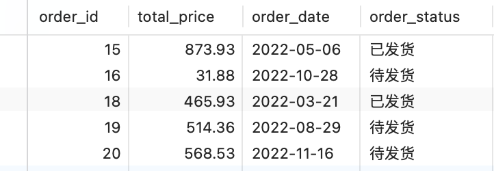

# 2023-2024秋 云计算技术课程项目文档


## 一、Hadoop集群架构

本项目采用如图1所示Hadoop集群架构：1个节点担任NameNode，3个节点担任DataNode。


<div style="text-align: center;">
  <p>图1 Hadoop集群架构</p>
</div>

4个节点具体职责如下表所示：

| NameNode                      | DataNode1                                        | DataNode2                 | DataNode3                 |
| ----------------------------- | ------------------------------------------------ | ------------------------- | ------------------------- |
| NameNode<br />ResourceManager | DataNode<br />NodeManager<br />SecondaryNameNode | DataNode<br />NodeManager | DataNode<br />NodeManager |


如图2所示，Hadoop集群中的节点均为阿里云服务器，4台服务器处于同一私网下，其IP地址的子网IP部分相同，相互之间可以很好地通信。


<div style="text-align: center;">
  <p>图2 阿里云服务器</p>
</div>

在NameNode上启动hadoop后，将其端口号50070转发至本地，在浏览器中可以查看集群节点信息，如图3所示。每个DataNode具有33G左右磁盘容量分配给HDFS，每个节点上占用空间相同，说明文件被备份冗余存储（本集群设置副本数为3）。


<div style="text-align: center;">
  <p>图3 集群节点信息</p>
</div>


## 二、基于Hive数据库的Web App

### 1. 页面与功能设计

在Hadoop集群上搭建Hive分布式数据库，基于该数据库开发了一个简易销售系统作为演示。图4～图7为该系统主要页面，支持数据的基本增删查改功能。因Hive数据库相比传统MySQL等关系型数据库具有较慢的查询、插入等操作速度，该系统采用分页加载、预加载、异步处理等技术提高系统性能，此外，本系统使用数据量较少，避免大量数据造成响应缓慢。


<div style="text-align: center;">
  <p>图4 主页商品列表</p>
</div>


<div style="text-align: center;">
  <p>图5 后台商品管理</p>
</div>


<div style="text-align: center;">
  <p>图6 后台订单管理</p>
</div>


<div style="text-align: center;">
  <p>图7 购物车页面</p>
</div>

### 2. 数据库设计

本系统建立了3个数据库表，其中填充了一定数量的随机数据作为演示，详见图8～图10，其中products表有数据约1000条，orders表有数据约500条，order_items有数据约3000条。


<div style="text-align: center;">
  <p>图8 products表</p>
</div>



<div style="text-align: center;">
  <p>图9 orders表</p>
</div>


<div style="text-align: center;">
  <p>图10 order_items表</p>
</div>

## 三、HDFS基本功能演示

为验证云系统具有基本的分布式存储功能，采用ssh连接各云服务器后运行bash脚本的方法。

## 1. 文件的上传与下载、文件的一致性

下面的bash脚本实现了验证云系统的以下基本功能：

- 从任意一个节点都能上传文件到系统中，也能从任意一个节点访问并下载系统中的文件
- 从任意一个节点访问并更新某个文件后，其在系统中的副本也相应进行更新。

具体来说，该bash脚本（在NameNode上运行）新建了文件file.txt并写入当前时间，然后上传该文件到HDFS中；接着ssh到DataNode1（或任意其他节点），下载并打印文件中的内容。接着在NameNode上更新该文件内容，即追加字符串"hello world"到本地文件，再将本地文件内容追加到HDFS中的文件，然后在DataNode2（或任意其他节点）上查看HDFS中的文件副本。

```bash
#!/bin/bash

# 文件和目录变量
LOCAL_FILE="file.txt"
HDFS_DIR="/test_dir"
HDFS_FILE_PATH="$HDFS_DIR/$LOCAL_FILE"

# 创建本地文件并写入当前时间
echo "$(date)" > $LOCAL_FILE

# 确保HDFS目录存在
hdfs dfs -mkdir -p $HDFS_DIR

# 上传文件到HDFS
echo "正在上传文件到HDFS..."
hdfs dfs -copyFromLocal -f $LOCAL_FILE $HDFS_FILE_PATH

# SSH到DataNode1并下载文件，打印内容
echo "SSH到DataNode1并下载文件..."
ssh DataNode1 "
    rm $LOCAL_FILE
    hdfs dfs -get $HDFS_FILE_PATH $LOCAL_FILE
    echo 'DataNode1上该文件的内容:'
    cat $LOCAL_FILE
    exit
"

# 更新文件内容
echo "添加'hello world'到文件..."
echo "hello world" >> $LOCAL_FILE
hdfs dfs -appendToFile $LOCAL_FILE $HDFS_FILE_PATH

# 本地验证文件更新
echo "本地验证文件更新..."
hdfs dfs -cat $HDFS_FILE_PATH

# SSH到DataNode2验证文件更新
echo "SSH到DataNode2和验证文件更新..."
ssh DataNode2 "
    hdfs dfs -cat $HDFS_FILE_PATH
    exit
"

```

该bash脚本运行结果如下。在DataNode1上查看该文件副本内容时，可以发现就算NameNode上传的文件；在DataNode2上查看副本文件内容时，可以发现副本已经被同步更新。证明云系统具备文件上传下载和一致性的基本分布式存储功能。


<div style="text-align: center;">
  <p>图11 运行结果（1）</p>
</div>

### 2. 文件的分块与备份

下面的bash脚本实现了验证云系统的以下基本功能：

- 系统对大容量文件以分块的形式存储，并且系统中存储的每个文件都有多个副本，当系统中不超过 20%的节点失效时，也 不影响 系统中所有文件的访问。

具体来说，该bash脚本（在NameNode上运行）将一个大文件（约600MB）上传到HDFS，并查看其分块和副本信息。

```bash
LOCAL_FILE="bigfile.txt"
HDFS_DIR="/test_dir"
HDFS_FILE_PATH="$HDFS_DIR/$LOCAL_FILE"

# 上传文件到HDFS
echo "正在上传大文件到HDFS..."
hdfs dfs -copyFromLocal -f $LOCAL_FILE $HDFS_FILE_PATH

# 展示文件分块和副本信息
echo "展示文件分块和副本信息..."
hdfs fsck $HDFS_FILE_PATH -files -blocks
```

该bash脚本运行结果如下。大文件上传后，被分成5块存储（HDFS设置了block size=128MB），且有3个副本文件。证明云系统具备文件的分块和备份这一基本分布式存储功能。


<div style="text-align: center;">
  <p>图12 运行结果（2）</p>
</div>